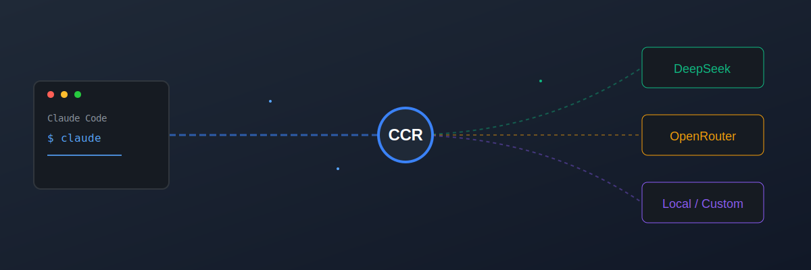

<p align="center">
  
</p>

<h1 align="center">Claude Code Router (CCR)</h1>

<p align="center">
  <strong>The Ultimate Bridge between Anthropic's Claude Code and the OpenAI Ecosystem.</strong>
</p>

<p align="center">
  <a href="README_zh.md">简体中文</a> |
  <a href="LICENSE"></a>
</p>

---

Claude Code Router (CCR) is a powerful, high-performance proxy and management suite designed to liberate [Claude Code](https://docs.anthropic.com/en/docs/claude-code/quickstart) from model lock-in. It allows you to route requests to any OpenAI-compatible API, giving you full control over costs, model selection, and privacy.

> [!IMPORTANT]
> **Version Support**: CCR is optimized for **Claude Code CLI v2.1.115 and above**.

## ✨ Why CCR?

| Feature | Original Claude Code | With CCR 🚀 |
| :--- | :--- | :--- |
| **Model Choice** | Limited to Anthropic Sonnet | **Any** OpenAI-compatible model (DeepSeek, GPT-4o, Llama, etc.) |
| **Cost Control** | Fixed Anthropic pricing | Use cheaper providers, local models, or free tiers |
| **Visibility** | Black-box requests | Full real-time monitoring and log inspection |
| **Flexibility** | Static configuration | Dynamic model switching and custom transformers |
| **Reasoning** | Standard output | Support for **Thinking/Reasoning** blocks from compatible models |

## 🏗️ The Trinity Architecture

CCR is built on three core pillars:

1.  **The Router (Core)**: A smart proxy that intercepts Anthropic-style requests and transforms them into standard OpenAI payloads, handling complex features like tool use, streaming, and image processing.
2.  **The CLI (`ccr`)**: A powerful terminal tool to manage the service, install presets, and launch Claude Code seamlessly with one command.
3.  **The Dashboard (Web UI)**: A beautiful local web interface to configure providers, manage API keys, and monitor request history in real-time.

## 🚀 Getting Started

### 1. Installation

```shell
# Install Claude Code (if you haven't)
npm install -g @anthropic-ai/claude-code

# Install Claude Code Router
npm install -g @musistudio/claude-code-router
```

### 2. Launch & Configure

Start the CCR service and open the dashboard:

```shell
ccr start
```

Open `http://localhost:3000` (default) in your browser to add your first provider (e.g., DeepSeek, OpenRouter, or SiliconFlow).

### 3. Start Coding

CCR provides a wrapper command that automatically configures the environment for you:

```shell
ccr code
```

## 🛠️ Advanced Features

### Dynamic Routing
Configure different models for different tasks. Use `/model` within Claude Code to switch your backend on-the-fly.

### Transformers System
Custom logic to handle provider-specific quirks. Whether it's forcing reasoning blocks or adjusting max tokens, CCR's transformer system ensures compatibility across the board.

### Community Presets
Don't want to configure everything manually? Install optimized presets from the community:
```shell
ccr install deepseek-v3
```

## 🌐 Supported Providers

CCR works with any OpenAI-compatible endpoint, including but not limited to:
- **OpenRouter** (Aggregator for all top models)
- **DeepSeek** (High performance, low cost)
- **SiliconFlow / Volcengine / DashScope**
- **Local Models** (Ollama, vLLM, LM Studio)
- **Groq / Cerebras** (Ultra-fast inference)

---

<p align="center">
  Built with ❤️ for the AI developer community.
</p>
